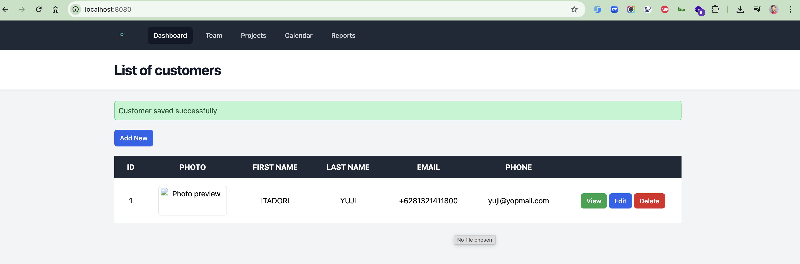
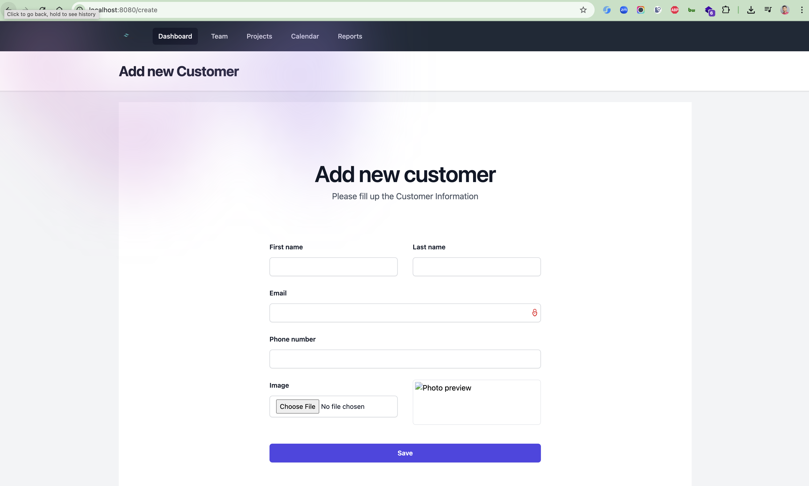
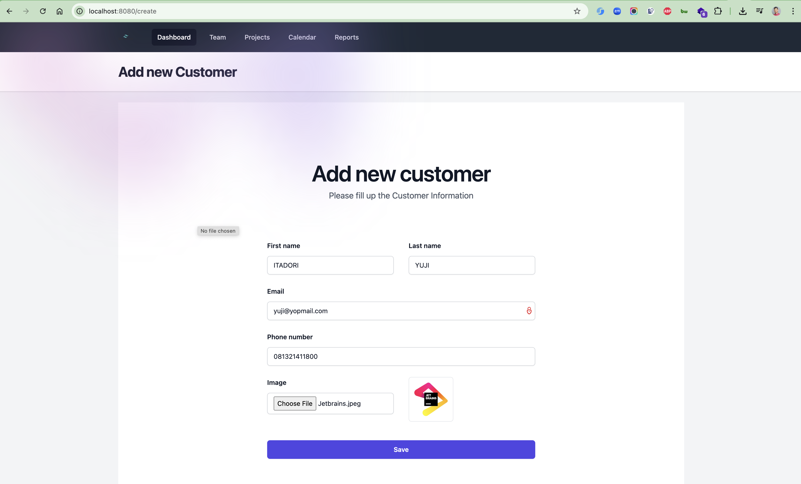
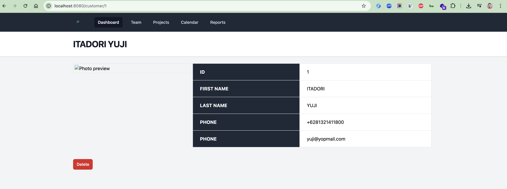

# Spring Boot Thymeleaf Sample

This is a sample project demonstrating the use of **Spring Boot** with **Thymeleaf** for building a simple web
application. The application manages a list of customers, allowing users to perform CRUD (Create, Read, Update, Delete)
operations.

## Features

- **Spring Boot** for backend development.
- **Thymeleaf** for server-side rendering of HTML templates.
- **Tailwind CSS** for responsive and modern UI design.
- **H2** in-memory database for storing customer data.
- **Docker Compose** for containerized application setup.
- **Kubernetes** and **Skaffold** for cloud-native deployment.

## Prerequisites

- Java 17 or higher
- Maven 3.8+
- Docker (optional, for containerized deployment)
- Kubernetes cluster (optional, for Kubernetes deployment)
- Skaffold (optional, for Kubernetes development workflow)

## Getting Started

### 1. Clone the Repository

```bash
git clone https://github.com/hendisantika/spring-boot-thymeleaf-sample2.git
cd spring-boot-thymeleaf-sample2
```

2. Database Setup
   The application uses H2 in-memory database by default, so no additional setup is required.
   The database configuration can be found in `src/main/resources/application.yml`.

3. Build and Run the Application

   **Option 1: Run with Maven**
    ```shell
    mvn clean install
    mvn clean spring-boot:run
    ```

   **Option 2: Run with Docker**
    ```shell
    mvn clean package
    docker-compose up -d
    ```

   When running with Docker, the `customer-photos` directory is mounted as a volume to persist photos outside the
   container. This ensures that uploaded customer photos are accessible from the web application.

   **Option 3: Run with Kubernetes and Skaffold**
    ```shell
    mvn clean package
    skaffold run
    ```

   For development with hot-reload:
    ```shell
    skaffold dev
    ```

   When running with Kubernetes, the application will be deployed to your Kubernetes cluster according to the manifests
   in the `k8s` directory.

   The application will be available at http://localhost:8081 (or through your Kubernetes cluster's ingress if
   configured).

   For detailed instructions on deploying to a Kubernetes cluster in a VPS environment,
   see [KUBERNETES_DEPLOYMENT.md](KUBERNETES_DEPLOYMENT.md).

   **Option 4: Continuous Deployment with GitHub Actions**

   This project includes a GitHub Actions workflow that automatically builds, pushes, and deploys the application to a
   Kubernetes cluster when changes are pushed to the main branch.

   For detailed instructions on setting up continuous deployment to Kubernetes with GitHub Actions,
   see [GITHUB_ACTIONS_K8S_DEPLOYMENT.md](GITHUB_ACTIONS_K8S_DEPLOYMENT.md).

### Application Endpoints

1. Home Page: `/` - Displays the list of customers.
2. Add Customer: `/create` - Form to add a new customer.
3. View Customer: `/customer/{id}` - View details of a specific customer.
4. Edit Customer: `/customer/{id}/edit` - Edit details of a specific customer.
5. Delete Customer: `/customer/{id}/delete` - Delete a specific customer.

### Technologies Used

1. Java 17
2. Spring Boot 3.x
3. Thymeleaf
4. Tailwind CSS
5. H2 Database
6. Docker Compose
7. Kubernetes
8. Skaffold

### Project Structure

`src/main/java` - Contains the Java source code.
`src/main/resources/templates` - Thymeleaf templates for the UI.
`src/main/resources/application.yml` - Configuration file for the application.
`Dockerfile` - Docker configuration for building the application image.
`docker-compose.yml` - Docker Compose configuration for running the application with volume mounts.
`k8s/deployment.yaml` - Kubernetes Deployment manifest.
`k8s/service.yaml` - Kubernetes Service manifest.
`skaffold.yaml` - Skaffold configuration for Kubernetes development workflow.

### Screenshots

#### Home Page
Displays the list of customers with options to view, edit, or delete.



#### Add Customer
Form to add a new customer.





#### View Customer
Displays detailed information about a specific customer.



### License
This project is licensed under the MIT License. See the LICENSE file for details.

### Author
Developed by Hendi Santika.
https://s.id/hendisantika
